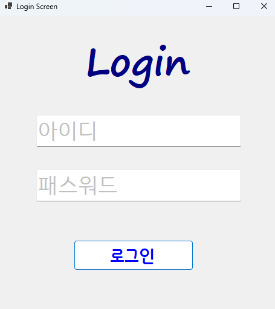
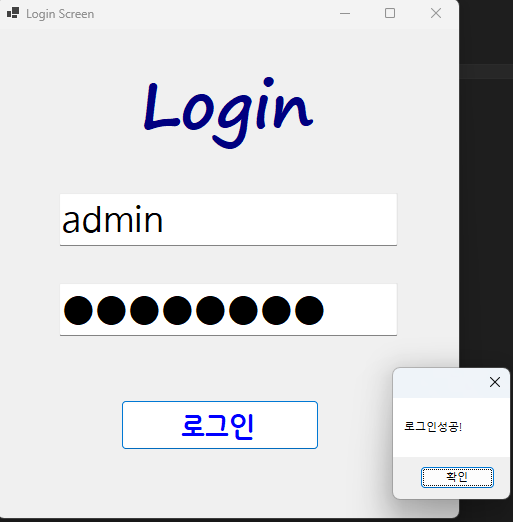
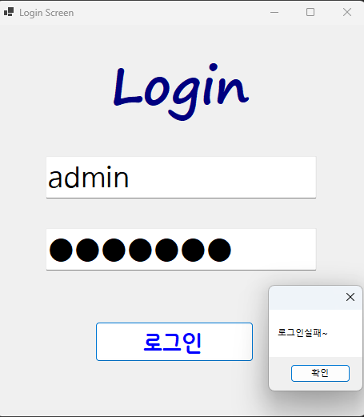
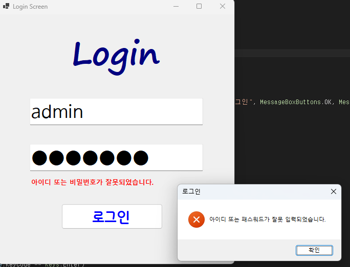

# (C# 코딩) 로그인 스크린
## 개요
- C# 프로그래밍 학습
- 1줄 소개: 아이디와 패스워드를 입력받아 로그인 성공 여부를 판단하는 간단한 로그인 스크린을 구현하는 과제입니다.
- 사용한 플랫폼:
- C#, .NET Windows Forms, Visual Studio, GitHub
- 사용한 컨트롤:
- Label, TextBox, Button
- 사용한 기술과 구현한 기능:
- Label, TextBox, Button 컨트롤을 이용하여 로그인 화면을 구성하였습니다.
- TextBox의 Enter와 Leave 이벤트를 활용하여 포커스시 아이디와 패스워드가 회색으로 나타나도록 구현하였습니다.
- Visual Studio를 이용하여 UI 디자인
- string 클래스를 이용한 사용자 입력 데이터 처리

## 실행 화면 (과제1)
- 과제1 코드의 실행 스크린샷

- 과제 내용
- Label(표시), TextBox(입력), Button(전송) 를 적절히 배치합니다.
- ID 텍스트 박스에 포커스가 있지 않을떄 회색으로 아이디가 뜨도록합니다.
- PW 텍스트 박스에 포커스가 있지 않을떄 회색으로 패스워드가 뜨도록합니다.
- ID와 PW 텍스트 박스에 포커스가 있을 때는 회색으로 아이디와 패스워드가 사라지도록합니다.
- 로그인 버튼 클릭시 저장된 아이디와 패스워드와 입력된 아이디와 패스워드를 비교하여 일치하면 "로그인 성공" 메시지를, 일치하지 않으면 "로그인 실패" 메시지를 출력하도록합니다.

- 구현 내용과 기능 설명
- Label, TextBox, Button 컨트롤을 이용하여 로그인 화면을 구성하였습니다.
- TextBox의 Enter와 Leave 이벤트를 활용하여 포커스시 아이디와 패스워드가 회색으로 나타나도록 구현하였습니다.
- 로그인 버튼 클릭 시 입력된 아이디와 패스워드를 미리 저장된 값과 비교하여 로그인 성공 또는 실패 메시지를 출력하도록 구현하였습니다.
- 처음 앱 실행시 포커스가 아이디 텍스트 박스에 위치하지 않고 버튼에 위치하여 아이디, 패스워드 안내가 보이도록 구현하였습니다.

## 실행 화면 (과제2)
- 과제2 코드의 실행 스크린샷

 
- 과제 내용
- 아이디 또는 패스워드가 잘못 입력되었을 때 에러 메시지 보여주기 
- MessageBox를 띄우지 말고 아이디와 패스워드를 입력하는 곳에 보여주기
- enter 키 입력시 아이디에서 패스워드로 포커스 이동 , 패스워드에서 로그인 버튼 클릭

- 구현 내용과 기능 설명
- Label 추가
- Visible 속성을 이용해서 메시지 보이기와 숨기기 기능 구현
- 라벨의 Visible 속성을 이용하여 처음에는 보이지 않다가 아이디 또는 패스워드를 잘못 입력했을시 보이도록 구현
- 아이디 또는 패스워드가 잘못입력 되었을떄 뜨는 Message 창 수정  